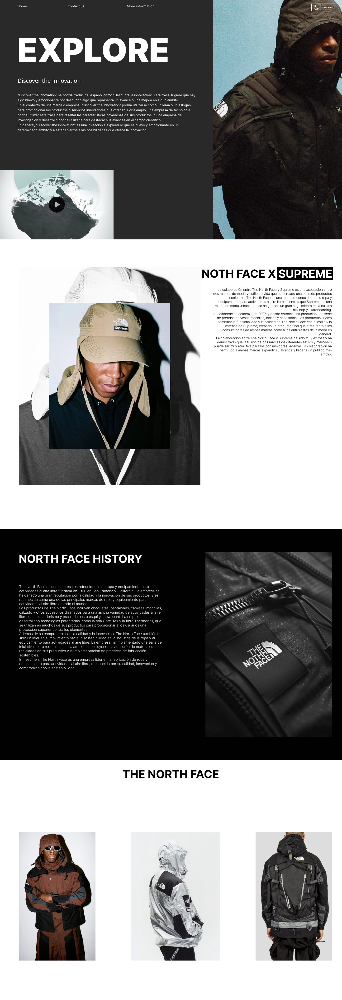

<h1>THE NORTH FACE - WEBSITE INSPIRATION </h1>

The North Face es una empresa estadounidense de ropa y equipamiento para actividades al aire libre fundada en 1966 en San Francisco, California. La empresa se ha ganado una gran reputación por la calidad y la innovación de sus productos, y es reconocida como una de las principales marcas de ropa y equipamiento para actividades al aire libre en todo el mundo.

Los productos de The North Face incluyen chaquetas, pantalones, camisas, mochilas, calzado y otros accesorios diseñados para una amplia variedad de actividades al aire libre, desde senderismo y escalada hasta esquí y snowboard. La empresa ha desarrollado tecnologías patentadas, como la tela Gore-Tex y la fibra Thermoball, que se utilizan en muchos de sus productos para proporcionar a los usuarios una protección superior contra los elementos.

Además de su compromiso con la calidad y la innovación, The North Face también ha sido un líder en el movimiento hacia la sostenibilidad en la industria de la ropa y el equipamiento para actividades al aire libre. La empresa ha implementado una serie de iniciativas para reducir su huella ambiental, incluyendo la adopción de materiales reciclados en sus productos y la implementación de prácticas de fabricación sostenibles.

En resumen, The North Face es una empresa líder en la fabricación de ropa y equipamiento para actividades al aire libre, reconocida por su calidad, innovación y compromiso con la sostenibilidad.

